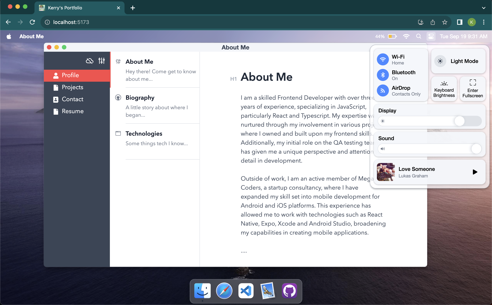

# Portfolio based on Mac OS

Powered by [React](https://reactjs.org/) + [Zustand](https://zustand-demo.pmnd.rs/) + [TypeScript](https://www.typescriptlang.org/) + [Vite](https://vitejs.dev/).





&nbsp;

## Usage

Clone the repo and install dependencies:

```bash
pnpm install
```

Start dev server (with hot reloading):

```bash
pnpm dev
```

Build for production with minification to the `dist` folder:

```bash
pnpm build
```

&nbsp;

## License

[MIT](MIT)
